<p align="center">
  
</p>

<h1 align="center">Multi-PDF·ChatBot</h1>

<p align="center">
  Upload multiple PDFs and chat across all of them with grounded answers and clickable source citations.
</p>

<p align="center">
  <a href="https://multi-pdf-chatbot-rb.streamlit.app/">Streamlit Live Demo</a> ·
  <a href="https://github.com/Rutujadb/Multi-PDF-ChatBot">GitHub</a> ·
  <a href="#architecture--design">Architecture</a>
</p>

---

## Live demos

| UI | URL | Notes |
|---|---|---|
| **Streamlit (classic)** | [multi-pdf-chatbot-rb.streamlit.app](https://multi-pdf-chatbot-rb.streamlit.app/) | Fully hosted PoC — upload, chat, and source preview in the browser |
| **React + FastAPI** | `<!-- TODO: add React deploy URL -->` _Coming soon_ | React dashboard requires the FastAPI backend; use [local dev](#react-ui--fastapi-recommended) until deployed |
| **GitHub repo** | [github.com/Rutujadb/Multi-PDF-ChatBot](https://github.com/Rutujadb/Multi-PDF-ChatBot) | Source code, issues, and contributions |

> **React deploy note:** The React UI is a static Vite build that talks to `POST /api/*` on a FastAPI server. When you deploy React (e.g. Vercel, Netlify, Cloudflare Pages), point the build at your hosted API URL and update `frontend/src/config.js` or environment variables accordingly.

---

## What it does

- Upload one or more PDF files into a shared knowledge base
- Ask natural-language questions answered from PDF content only
- See which PDF and page each answer came from (source citations)
- Click a source chip to open a highlighted PDF preview (React UI)
- Hold a context-aware conversation — follow-up questions understand prior turns
- Clear chat or reset the session at any time

---

## Screenshots

### React UI

| Landing page | Dashboard — upload & index |
|:---:|:---:|
| 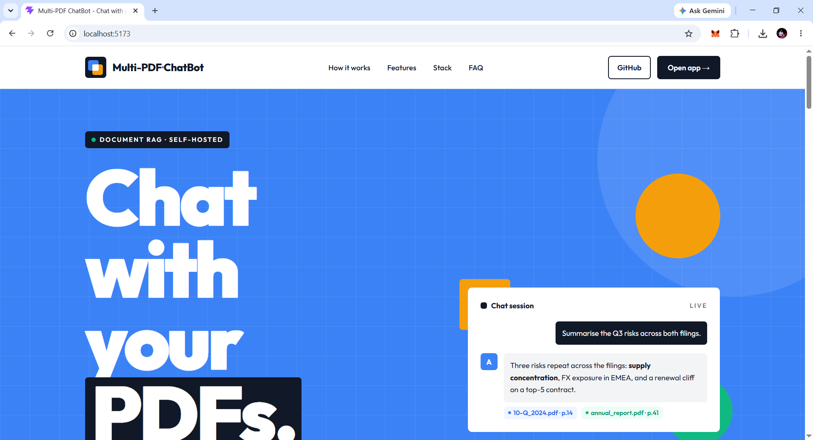 | 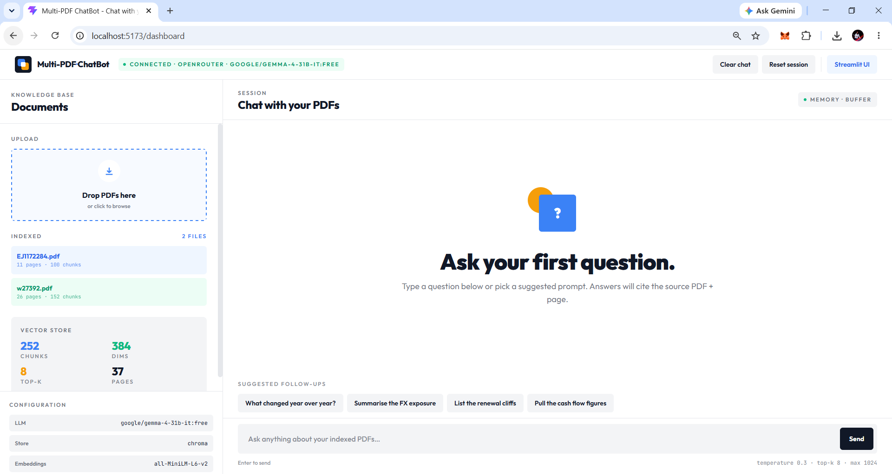 |

| Chat with sources | Source preview panel |
|:---:|:---:|
| 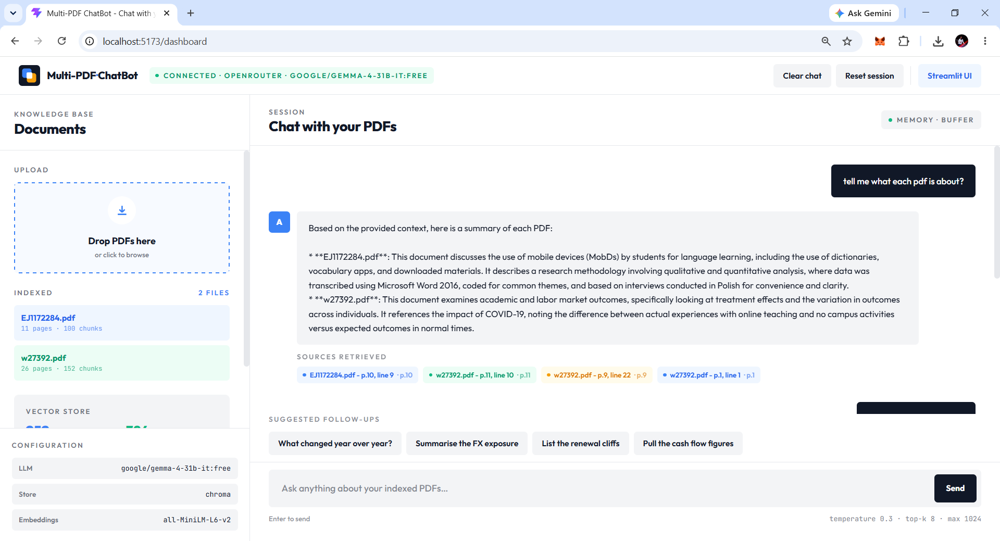 | 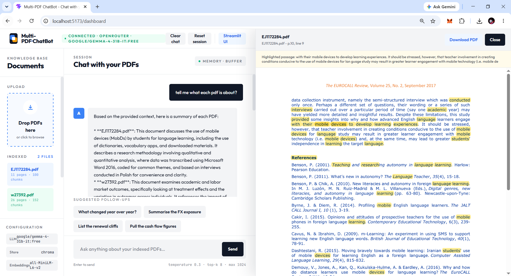 |

| Architecture flowchart |
|:---:|
| 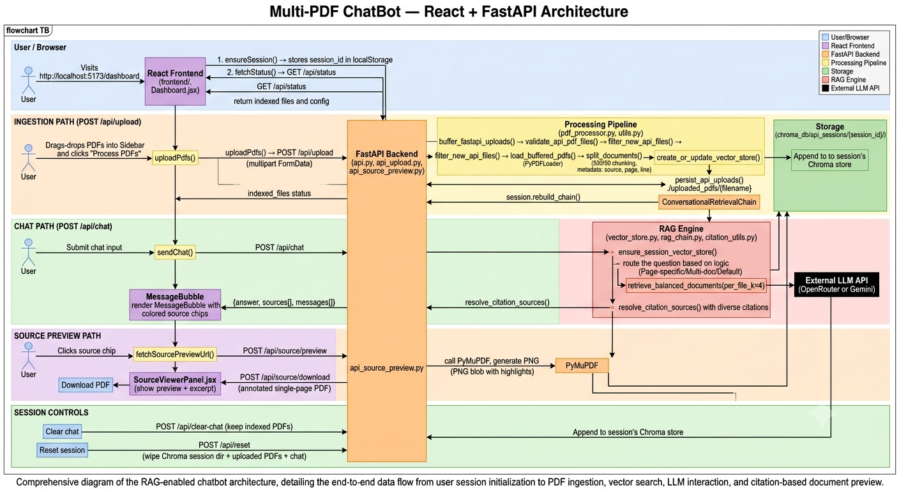 |

### Streamlit UI

| Sidebar upload | Chat with citations |
|:---:|:---:|
| 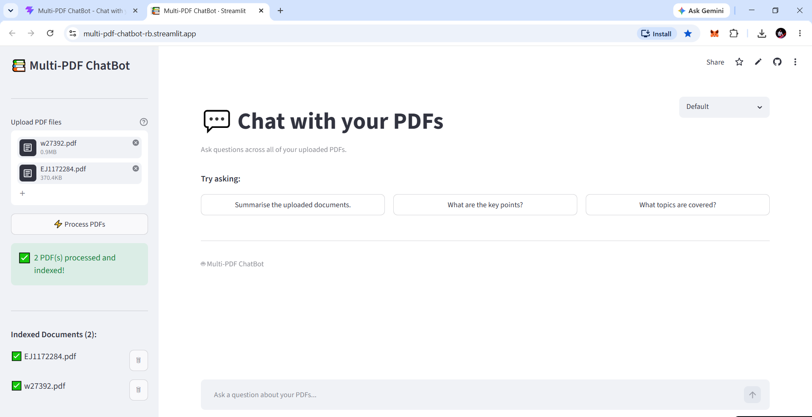 | 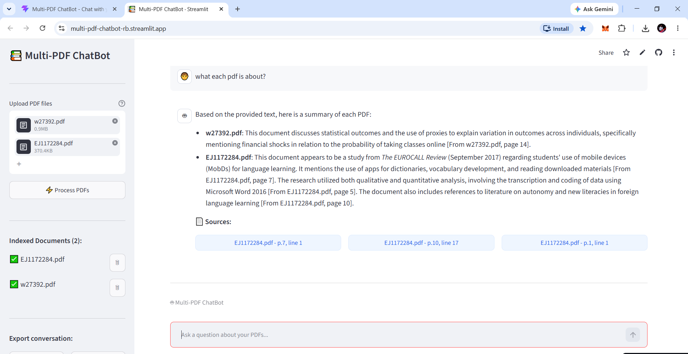 |

| Architecture flowchart |
|:---:|
| 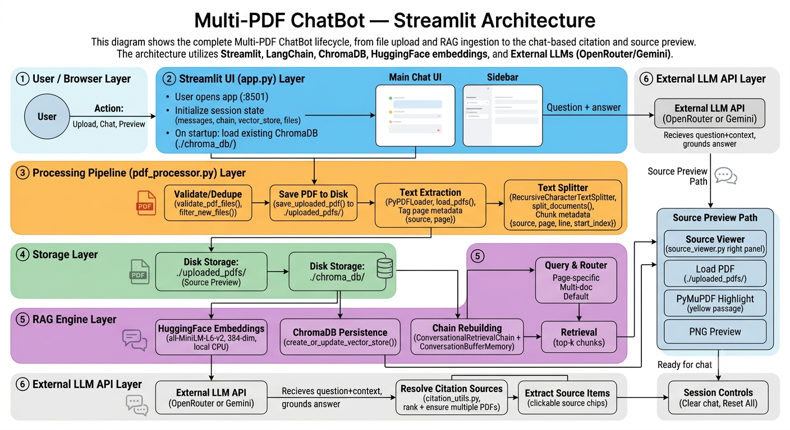 |

---

## Tech stack

| Layer | Technology |
|---|---|
| UI | React + Vite + Tailwind (landing + dashboard), Streamlit (classic alt) |
| API | FastAPI (`api.py`) — wraps the LangChain pipeline for React |
| Orchestration | LangChain + `langchain-classic` (`ConversationalRetrievalChain`) |
| PDF parsing | PyPDFLoader / pypdf |
| Embeddings (local) | HuggingFace `all-MiniLM-L6-v2` (384-dim, CPU) |
| Vector store | ChromaDB (persistent, per-session for React API) |
| LLM | OpenRouter (default) or Google Gemini 2.0 Flash |
| Source preview | PyMuPDF highlights (PNG preview + downloadable annotated PDF) |
| Config | python-dotenv |

---

## Architecture & design

This section documents the RAG **ingestion** and **retrieval** pipelines, the thinking behind key decisions, and what we learned while building a reliable multi-PDF experience.

### High-level overview

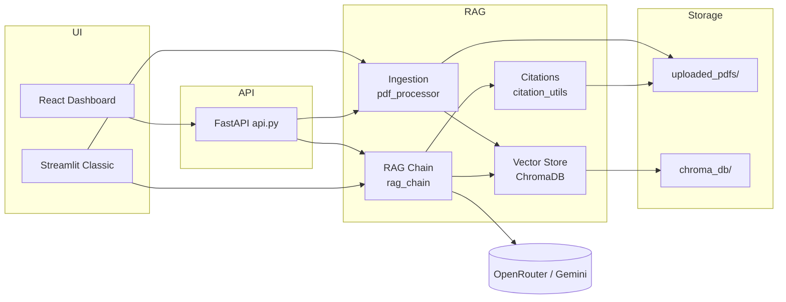

---

### RAG ingestion pipeline

**Goal:** Turn uploaded PDFs into searchable, citeable chunks with rich metadata.

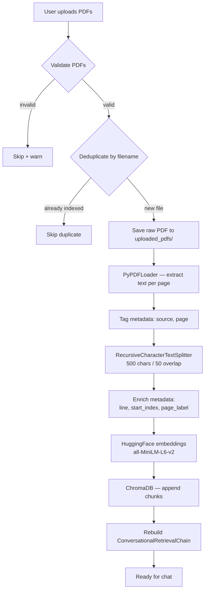

| Step | Module | Detail |
|---|---|---|
| Upload | `api_upload.py` / `app.py` | React uses FastAPI `UploadFile`; Streamlit uses `st.file_uploader` |
| Validation | `utils.py` | PDF extension + non-empty file check |
| Dedup | `filter_new_files()` | Filename match against indexed sources — no re-embedding |
| Persist PDF | `pdf_storage.py` | `uploaded_pdfs/{filename}` for source preview |
| Extract | `pdf_processor.py` | Temp file → PyPDFLoader → one `Document` per page |
| Chunk | `pdf_processor.py` | Split **per page** so `line` metadata is accurate |
| Embed | `vector_store.py` | Local model, no API key; torch loaded before chromadb (Windows safety) |
| Store | `vector_store.py` | Streamlit: `./chroma_db/` · React API: `./chroma_db/api_sessions/{session_id}/` |
| Index mode | `create_or_update_vector_store()` | **Append** — new PDFs accumulate, old ones are kept |

**Chunk metadata (every stored vector):**

```json
{
  "source": "report.pdf",
  "page": 0,
  "page_label": 1,
  "line": 12,
  "start_index": 340
}
```

---

### RAG retrieval pipeline

**Goal:** Retrieve the right context for each question type, generate a grounded answer, and show citations that match what the user actually read.

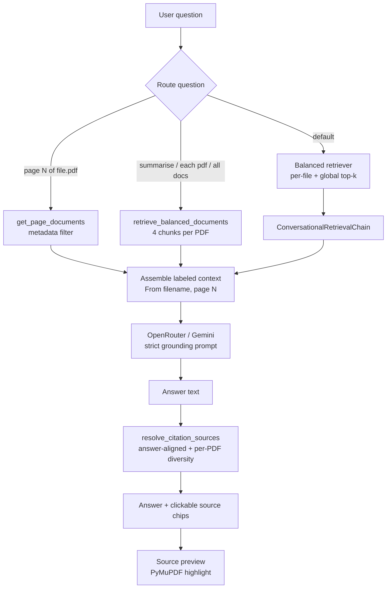

| Route | Trigger | Retrieval strategy |
|---|---|---|
| **Page-targeted** | `"page 7 of report.pdf"` | `get_page_documents()` — all chunks on that page |
| **Multi-doc overview** | `"summarise"`, `"what each pdf is about"` | `retrieve_balanced_documents(per_file_k=4)` → `answer_from_documents()` |
| **Default Q&A** | Everything else | `ConversationalRetrievalChain` with **balanced retriever** |

**Balanced retrieval** (`retrieve_balanced_documents`) — the core fix for multi-PDF:

1. For each indexed filename, run similarity search scoped to that file (`filter: {source: filename}`)
2. Merge with global top-k results
3. Deduplicate by `(source, page, start_index, content)`

This prevents one large PDF from filling all retrieval slots.

**Citation resolution** (`resolve_citation_sources`):

- Re-ranks retrieved chunks against the generated answer (embedding + lexical overlap)
- When the answer mentions multiple PDFs, ensures **at least one citation per file**
- React source panel: `POST /api/source/preview` → PNG with yellow highlights; download annotated PDF

---

### Design decisions

| Decision | Choice | Why |
|---|---|---|
| **Embeddings** | Local `all-MiniLM-L6-v2` | No API key, ~90 MB one-time download, fast enough for PoC |
| **Vector DB** | ChromaDB (embedded) | Zero infra, persists to disk, good LangChain integration |
| **Chunk size** | 500 / 50 overlap | Balance between context granularity and retrieval precision |
| **Per-page chunking** | Split one page at a time | Accurate `line` numbers for citations |
| **Dual UI** | React + Streamlit | React matches design system; Streamlit is quick to deploy on Community Cloud |
| **API layer** | FastAPI for React only | Keeps Streamlit self-contained; shared Python modules unchanged |
| **Per-session Chroma (React)** | `chroma_db/api_sessions/{id}/` | Isolates sessions; survives API restart when `session_id` is restored |
| **Balanced retrieval** | Per-file + global merge | Plain top-k failed on multi-PDF — one document dominated results |
| **Overview routing** | Regex intent detection | `"summarise"` and `"each pdf"` need guaranteed per-file context |
| **Citation diversity** | Per-PDF minimum in UI | Answer could mention 2 PDFs while sources showed only 1 |
| **PDF on disk** | `uploaded_pdfs/` | Enables PyMuPDF highlight preview; vectors alone are not enough |
| **LLM grounding** | Strict refusal phrase | Prevents hallucination outside uploaded content |
| **Source preview (Streamlit Cloud)** | PNG not iframe PDF | Chrome blocks PDF iframes on Streamlit Cloud |

---

### Thinking approach

1. **Start with the simplest correct pipeline** — single PDF, top-k retrieval, one UI (Streamlit). Prove upload → embed → chat → cite works end-to-end.

2. **Separate concerns early** — `pdf_processor`, `vector_store`, `rag_chain`, `citation_utils` each own one stage. UI layers (Streamlit vs React API) call the same core, not duplicate logic.

3. **Observe failures, then fix the right layer** — Multi-PDF bugs looked like indexing issues but were actually **retrieval skew** (large PDF wins similarity) and **citation filtering** (answer mentioned 2 files, UI showed 1). Fixing storage alone did not help.

4. **Metadata is a product feature** — `source`, `page`, `line`, and `highlight_phrases` power trust: users can verify answers. Invest in metadata at ingestion time.

5. **Route by intent, not one retrieval path** — Page questions, overview questions, and specific Q&A need different retrieval strategies. A single `top_k=6` path cannot serve all three well.

6. **Deploy constraints shape UX** — Streamlit Cloud cannot show PDF iframes reliably; PNG preview was the pragmatic fix. React can use a richer side panel with blob URLs.

---

### Learnings

- **Top-k similarity is not multi-document aware.** With 2+ PDFs, always ensure per-file representation in context before calling the LLM.
- **The LLM can summarize correctly while citations lie.** Citation resolution must enforce diversity when the answer references multiple files.
- **Session state matters for React.** API restarts + stale `session_id` caused uploads and chat to diverge; per-session Chroma paths and session restoration fixed it.
- **Incremental indexing must append, not replace.** `create_or_update_vector_store` with `existing_store` avoids losing prior PDFs on new uploads.
- **Chunk size trades off retrieval vs context window.** 500-char chunks work for Q&A; overview questions benefit from more chunks per file (4+).
- **Local embeddings + remote LLM is a practical split.** Embeddings are free and private; only generation needs an API key.
- **Filename dedup is simple but effective.** Re-uploading the same filename is skipped — good for UX, but users must rename files to re-index changed content.

---

## Prerequisites

- Python 3.10+
- Node.js 18+ (React UI only)
- An LLM API key — [OpenRouter](https://openrouter.ai/) or [Google AI Studio](https://aistudio.google.com)
- Internet for LLM calls and the one-time embedding model download (~90 MB)

## Installation

```bash
python -m venv venv

# Windows
venv\Scripts\activate
# macOS / Linux
source venv/bin/activate

pip install -r requirements.txt
```

> The first run downloads the HuggingFace embedding model (~90 MB). Subsequent runs use the local cache.

## Configuration

```bash
cp .env.example .env      # Windows: copy .env.example .env
```

Example `.env`:

```env
LLM_PROVIDER=openrouter
OPENROUTER_API_KEY=your_key_here
OPENROUTER_MODEL=google/gemma-2-9b-it:free

VECTOR_STORE=chroma
STREAMLIT_APP_URL=https://multi-pdf-chatbot-rb.streamlit.app/
```

> **Never commit `.env`** — it is git-ignored.

## Running locally

### React UI + FastAPI (recommended)

```bash
python run_dev.py
```

| Service | URL |
|---|---|
| Landing + dashboard | http://localhost:5173 |
| FastAPI backend | http://localhost:8000 |

With Streamlit classic alongside:

```bash
python run_dev.py --streamlit
```

Streamlit opens at http://localhost:8501.

### Streamlit only

```bash
streamlit run app.py
```

## How to use

### React dashboard

1. Open http://localhost:5173/dashboard
2. Drop PDFs in the sidebar → **Process PDFs**
3. Ask a question — sources appear as clickable chips
4. Click a source to open the highlighted PDF preview panel
5. **Clear chat** keeps indexed PDFs · **Reset session** wipes everything

### Streamlit classic

1. Upload PDFs in the sidebar → **Process PDFs**
2. Type a question in the chat box
3. Click a source citation to preview the highlighted page
4. **Clear Chat** or **Reset All** as needed

## Project structure

```
multi-pdf-chatbot/
├── app.py                  # Streamlit classic UI
├── api.py                  # FastAPI backend (React)
├── api_upload.py           # FastAPI upload helpers
├── api_source_preview.py   # Highlighted PDF preview/download (React)
├── run_dev.py              # Start React + API (+ optional Streamlit)
├── frontend/               # React + Tailwind UI
│   ├── public/favicon.svg  # App logo
│   └── src/
├── pdf_processor.py        # PDF load, chunk, dedup
├── pdf_storage.py          # Persist PDFs for preview
├── vector_store.py         # ChromaDB, embeddings, balanced retrieval
├── rag_chain.py            # LangChain RAG + memory
├── citation_utils.py       # Answer-aligned citation ranking
├── source_viewer.py        # Streamlit source panel
├── utils.py                # Validation, source formatting, routing helpers
├── config.py               # Constants and env vars
├── docs/screenshots/       # Workflow screenshots (add your images here)
├── chroma_db/              # Persisted vectors (auto-created)
└── uploaded_pdfs/          # Persisted PDFs for preview (auto-created)
```

## Known limitations

- **Single-user / localhost** — not designed for concurrent multi-user production load
- **Text-based PDFs only** — scanned image-only PDFs are not supported (no OCR)
- **Chat history is session-scoped** — lost on browser refresh (indexed vectors persist on disk)
- **LLM rate limits** apply per provider (OpenRouter / Gemini free tiers)
- **React deploy** requires a hosted FastAPI backend — static frontend alone cannot chat

## Future scope

- **OCR for scanned documents** — support image-only PDFs by extracting text from scans before chunking and indexing
- **Real-time suggested follow-ups**
  - After each answer, generate contextual follow-up questions from the user's question and the assistant's response
  - When chat is empty but PDFs are indexed, generate starter questions from the processed document index (topics and content across uploaded files)

## License

See repository for license details.
