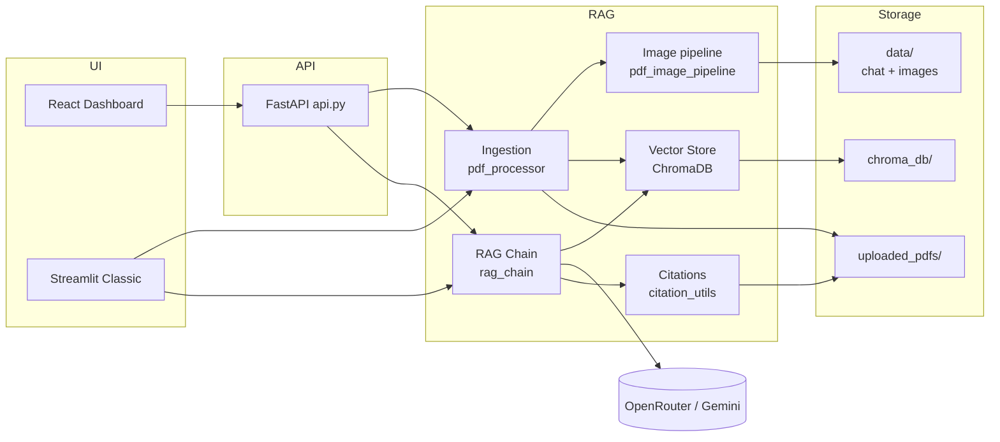
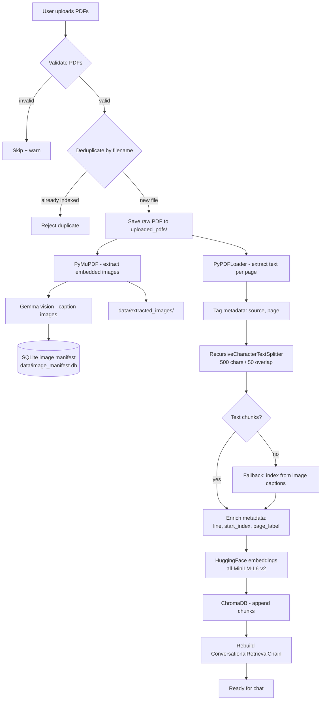
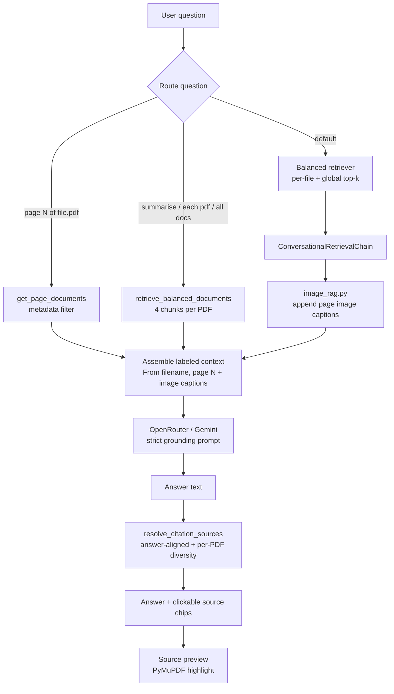

<p align="center">
  
</p>

<h1 align="center">Multi-PDF·ChatBot</h1>

<p align="center">
  Upload multiple PDFs and chat across all of them with grounded answers and clickable source citations.
</p>

<p align="center">
  <a href="https://multi-pdf-chat-bot.vercel.app/">React Live Demo</a> ·
  <a href="https://multi-pdf-chatbot-rb.streamlit.app/">Streamlit Live Demo</a> ·
  <a href="https://github.com/Rutujadb/Multi-PDF-ChatBot">GitHub</a> ·
  <a href="#architecture--design">Architecture</a>
</p>

---

## Live demos

| UI | URL | Notes |
|---|---|---|
| **React UI (Vercel)** | [multi-pdf-chat-bot.vercel.app](https://multi-pdf-chat-bot.vercel.app/) | Landing + dashboard — recommended |
| **FastAPI backend (Render)** | [multi-pdf-chatbot-y6nu.onrender.com](https://multi-pdf-chatbot-y6nu.onrender.com) | API for the React UI ([health check](https://multi-pdf-chatbot-y6nu.onrender.com/api/health)) |
| **Streamlit (classic)** | [multi-pdf-chatbot-rb.streamlit.app](https://multi-pdf-chatbot-rb.streamlit.app/) | Alternate hosted UI — upload, chat, and source preview |
| **GitHub repo** | [github.com/Rutujadb/Multi-PDF-ChatBot](https://github.com/Rutujadb/Multi-PDF-ChatBot) | Source code, issues, and contributions |

> **React + API:** The Vercel frontend calls the Render API at `https://multi-pdf-chatbot-y6nu.onrender.com`. On Render free tier the API may sleep after inactivity — the first request can take 1–3 minutes to wake up.

---

## What it does

- Upload one or more PDF files into a shared knowledge base
- Ask natural-language questions answered from PDF content only
- **Extract embedded images from PDFs** (PyMuPDF) and caption them with a Gemma vision model
- See which PDF and page each answer came from (source citations)
- Click a source chip to open a highlighted PDF preview (React UI)
- Hold a context-aware conversation - follow-up questions understand prior turns
- **Persistent chat memory** (SQLite) survives app restarts per session
- Switch between available configured LLMs from a **Models** dropdown
- Reject duplicate filenames with `you cannot add same file twice`
- Clear chat or reset the session at any time

---

## Screenshots

### React UI

| Landing page | Dashboard - upload & index |
|:---:|:---:|
|  |  |

| Chat with sources | Source preview panel |
|:---:|:---:|
|  |  |

| Architecture flowchart |
|:---:|
|  |

### Streamlit UI

| Sidebar upload | Chat with citations |
|:---:|:---:|
|  |  |

| Architecture flowchart |
|:---:|
|  |

---

## Tech stack

| Layer | Technology |
|---|---|
| UI | React + Vite + Tailwind (landing + dashboard), Streamlit (classic alt) |
| API | FastAPI (`api.py`) - wraps the LangChain pipeline for React |
| Orchestration | LangChain + `langchain-classic` (`ConversationalRetrievalChain`) |
| PDF parsing | PyPDFLoader / pypdf |
| Image extraction | PyMuPDF (`pdf_image_extractor.py`) — images on disk, not in Chroma |
| Image captioning | Gemma vision via OpenRouter or Gemini (`image_captioner.py`) |
| Embeddings (local) | HuggingFace `all-MiniLM-L6-v2` (384-dim, CPU) |
| Vector store | ChromaDB (persistent, per-session for React API) |
| Chat memory | SQLite (`sqlite_memory.py`) — `./data/chat_memory.db` |
| Logging | Python `logging` — structured terminal output across all modules |
| LLM | OpenRouter, Groq, Nvidia NIM, or Google Gemini |
| Source preview | PyMuPDF highlights (PNG preview + downloadable annotated PDF) |
| Config | python-dotenv |

---

## Architecture & design

This section documents the RAG **ingestion** and **retrieval** pipelines, the thinking behind key decisions, and what we learned while building a reliable multi-PDF experience.

### High-level overview



---

### RAG ingestion pipeline

**Goal:** Turn uploaded PDFs into searchable, citeable chunks with rich metadata.



| Step | Module | Detail |
|---|---|---|
| Upload | `api_upload.py` / `app.py` | React uses FastAPI `UploadFile`; Streamlit uses `st.file_uploader` |
| Validation | `utils.py` | PDF extension + non-empty file check |
| Dedup | `filter_new_files()` | Filename match against indexed sources - no re-embedding |
| Persist PDF | `pdf_storage.py` | `uploaded_pdfs/{filename}` for source preview |
| Extract images | `pdf_image_extractor.py` | PyMuPDF → `data/extracted_images/{session}/{pdf}/` |
| Caption images | `image_captioner.py` | Gemma vision → text stored in `data/image_manifest.db` |
| Image manifest | `image_store.py` | SQLite refs + captions (**not** stored in Chroma) |
| Orchestration | `pdf_image_pipeline.py` | Extract → caption → caption-chunk fallback |
| Extract text | `pdf_processor.py` | Temp file → PyPDFLoader → one `Document` per page |
| Chunk | `pdf_processor.py` | Split **per page** so `line` metadata is accurate |
| Embed | `vector_store.py` | Local model, no API key; torch loaded before chromadb (Windows safety) |
| Store | `vector_store.py` | Streamlit: `./chroma_db/` · React API: `./chroma_db/api_sessions/{session_id}/` |
| Index mode | `create_or_update_vector_store()` | **Append** - new PDFs accumulate, old ones are kept |

**Chunk metadata (every stored vector):**

```json
{
  "source": "report.pdf",
  "page": 0,
  "page_label": 1,
  "line": 12,
  "start_index": 340
}
```

---

### RAG retrieval pipeline

**Goal:** Retrieve the right context for each question type, generate a grounded answer, and show citations that match what the user actually read.



| Route | Trigger | Retrieval strategy |
|---|---|---|
| **Page-targeted** | `"page 7 of report.pdf"` | `get_page_documents()` - all chunks on that page |
| **Multi-doc overview** | `"summarise"`, `"what each pdf is about"` | `retrieve_balanced_documents(per_file_k=4)` → `answer_from_documents()` |
| **Default Q&A** | Everything else | `ConversationalRetrievalChain` with **balanced retriever** + `image_rag.py` caption context |

**Balanced retrieval** (`retrieve_balanced_documents`) - the core fix for multi-PDF:

1. For each indexed filename, run similarity search scoped to that file (`filter: {source: filename}`)
2. Merge with global top-k results
3. Deduplicate by `(source, page, start_index, content)`

This prevents one large PDF from filling all retrieval slots.

**Citation resolution** (`resolve_citation_sources`):

- Re-ranks retrieved chunks against the generated answer (embedding + lexical overlap)
- When the answer mentions multiple PDFs, ensures **at least one citation per file**
- Uses stricter answer/question overlap thresholds to reduce irrelevant citations
- Prefers tighter excerpt fragments and line-aware matches for more precise highlighting
- React source panel: `POST /api/source/preview` → PNG with yellow highlights; download annotated PDF

**LLM sampling defaults**:

- `top_p = 0.85` cuts weird/random low-probability words while keeping natural phrasing.
- `top_k = 40` is an industry-standard default for balancing variety and focus.
- This is decoding `top_k`, separate from retrieval top-k used for document search.

---

### Design decisions

| Decision | Choice | Why |
|---|---|---|
| **Embeddings** | Local `all-MiniLM-L6-v2` | No API key, ~90 MB one-time download, fast enough for PoC |
| **Vector DB** | ChromaDB (embedded) | Zero infra, persists to disk, good LangChain integration |
| **Chunk size** | 500 / 50 overlap | Balance between context granularity and retrieval precision |
| **Per-page chunking** | Split one page at a time | Accurate `line` numbers for citations |
| **Dual UI** | React + Streamlit | React matches design system; Streamlit is quick to deploy on Community Cloud |
| **API layer** | FastAPI for React only | Keeps Streamlit self-contained; shared Python modules unchanged |
| **Per-session Chroma (React)** | `chroma_db/api_sessions/{id}/` | Isolates sessions; survives API restart when `session_id` is restored |
| **Per-session chat history** | SQLite (`sqlite_memory.py`) | Persists conversation turns to `./data/chat_memory.db` |
| **Balanced retrieval** | Per-file + global merge | Plain top-k failed on multi-PDF - one document dominated results |
| **Structured logging** | Python `logging` in every module | Traces every API call, LLM invocation, indexing step, and error in terminal |
| **Overview routing** | Regex intent detection | `"summarise"` and `"each pdf"` need guaranteed per-file context |
| **Citation diversity** | Per-PDF minimum in UI | Answer could mention 2 PDFs while sources showed only 1 |
| **Precise highlight targeting** | Line-aware phrase search | Cited `page` + `line` should highlight that line, not broad page text |
| **PDF on disk** | `uploaded_pdfs/` | Enables PyMuPDF highlight preview; vectors alone are not enough |
| **Images outside Chroma** | `data/extracted_images/` + SQLite manifest | Professor/design constraint: caption with LLM, index text only |
| **LLM grounding** | Strict refusal phrase | Prevents hallucination outside uploaded content |
| **LLM sampling** | `top_p=0.85`, `top_k=40` | Keeps language natural while reducing random token choices |
| **Source preview (Streamlit Cloud)** | PNG not iframe PDF | Chrome blocks PDF iframes on Streamlit Cloud |

---

### Thinking approach

1. **Start with the simplest correct pipeline** - single PDF, top-k retrieval, one UI (Streamlit). Prove upload → embed → chat → cite works end-to-end.

2. **Separate concerns early** - `pdf_processor`, `vector_store`, `rag_chain`, `citation_utils` each own one stage. UI layers (Streamlit vs React API) call the same core, not duplicate logic.

3. **Observe failures, then fix the right layer** - Multi-PDF bugs looked like indexing issues but were actually **retrieval skew** (large PDF wins similarity) and **citation filtering** (answer mentioned 2 files, UI showed 1). Fixing storage alone did not help.

4. **Metadata is a product feature** - `source`, `page`, `line`, and `highlight_phrases` power trust: users can verify answers. Invest in metadata at ingestion time.

5. **Route by intent, not one retrieval path** - Page questions, overview questions, and specific Q&A need different retrieval strategies. A single `top_k=6` path cannot serve all three well.

6. **Deploy constraints shape UX** - Streamlit Cloud cannot show PDF iframes reliably; PNG preview was the pragmatic fix. React can use a richer side panel with blob URLs.

---

### Learnings

- **Top-k similarity is not multi-document aware.** With 2+ PDFs, always ensure per-file representation in context before calling the LLM.
- **The LLM can summarize correctly while citations lie.** Citation resolution must enforce diversity when the answer references multiple files.
- **Session state matters for React.** API restarts + stale `session_id` caused uploads and chat to diverge; per-session Chroma paths and session restoration fixed it.
- **Incremental indexing must append, not replace.** `create_or_update_vector_store` with `existing_store` avoids losing prior PDFs on new uploads.
- **Chunk size trades off retrieval vs context window.** 500-char chunks work for Q&A; overview questions benefit from more chunks per file (4+).
- **Local embeddings + remote LLM is a practical split.** Embeddings are free and private; only generation needs an API key.
- **Duplicate uploads need explicit rejection.** The app now blocks already-indexed files and duplicate filenames in the same upload batch, returning the existing document reference.
- **Line-aware highlighting improves trust.** Narrowing highlights to the cited line/fragment avoids broad page-wide marks that look imprecise.
- **Structured logging is essential for debugging RAG.** Every module logs API calls, LLM invocations, indexing steps, and errors to the terminal with timestamps, log levels, and module names.

---

## Prerequisites

- Python 3.10+
- Node.js 18+ (React UI only)
- At least one LLM API key - [OpenRouter](https://openrouter.ai/), [Groq](https://console.groq.com/keys), [NVIDIA NIM](https://build.nvidia.com/), or [Google AI Studio](https://aistudio.google.com)
- Internet for LLM calls and the one-time embedding model download (~90 MB)

## Installation

```bash
python -m venv venv

# Windows
venv\Scripts\activate
# macOS / Linux
source venv/bin/activate

pip install -r requirements.txt
```

> The first run downloads the HuggingFace embedding model (~90 MB). Subsequent runs use the local cache.

## Configuration

```bash
cp .env.example .env      # Windows: copy .env.example .env
```

Example `.env`:

```env
LLM_PROVIDER=openrouter
OPENROUTER_API_KEY=your_key_here
OPENROUTER_MODEL=google/gemma-2-9b-it:free
GROQ_API_KEY=your_key_here
GROQ_MODEL=meta-llama/llama-4-scout-17b-16e-instruct
NVIDIA_API_KEY=your_key_here
NVIDIA_MODEL=meta/llama-4-maverick-17b-128e-instruct
GOOGLE_API_KEY=your_key_here

# Image extraction + Gemma vision captions (optional)
IMAGE_EXTRACTION_ENABLED=true
IMAGE_CAPTION_ENABLED=true
IMAGE_CAPTION_PROVIDER=openrouter
IMAGE_CAPTION_MODEL=google/gemma-3-12b-it

VECTOR_STORE=chroma
CHAT_DB_PATH=./data/chat_memory.db
STREAMLIT_APP_URL=https://multi-pdf-chatbot-rb.streamlit.app/
```

> **Never commit `.env`** - it is git-ignored.

## Running locally

### React UI + FastAPI (recommended)

```bash
python run_dev.py
```

| Service | URL |
|---|---|
| Landing + dashboard | http://localhost:5173 |
| FastAPI backend | http://localhost:8000 |

With Streamlit classic alongside:

```bash
python run_dev.py --streamlit
```

Streamlit opens at http://localhost:8501.

### Streamlit only

```bash
streamlit run app.py
```

## How to use

### React dashboard (live)

1. Open [multi-pdf-chat-bot.vercel.app/dashboard](https://multi-pdf-chat-bot.vercel.app/dashboard)
2. Pick a provider/model from the **Models** dropdown
3. Drop PDFs in the sidebar → **Process PDFs**
4. Ask a question - sources appear as clickable chips
5. Click a source to open the highlighted PDF preview panel
6. **Clear chat** keeps indexed PDFs · **Reset session** wipes everything

> If the API was idle, wait 1–3 minutes after your first action for [Render](https://multi-pdf-chatbot-y6nu.onrender.com/api/health) to wake up.
> Duplicate filenames are rejected with `you cannot add same file twice` and the existing document reference.

### React dashboard (local dev)

1. Open http://localhost:5173/dashboard
2. Follow the same steps as above

### Streamlit classic

1. Pick a provider/model from the **Models** dropdown in the sidebar
2. Upload PDFs in the sidebar → **Process PDFs**
3. Type a question in the chat box
4. Click a source citation to preview the highlighted page
5. **Clear Chat** or **Reset All** as needed

## Project structure

```
multi-pdf-chatbot/
├── app.py                  # Streamlit classic UI
├── api.py                  # FastAPI backend (React)
├── api_upload.py           # FastAPI upload helpers
├── api_source_preview.py   # Highlighted PDF preview/download (React)
├── run_dev.py              # Start React + API (+ optional Streamlit)
├── start.py                # Production-style launcher
├── frontend/               # React + Tailwind UI
│   ├── public/favicon.svg  # App logo
│   └── src/
│       ├── pages/          # Landing, Dashboard
│       ├── components/     # Logo, SourceViewerPanel
│       └── api/client.js   # FastAPI client
├── pdf_processor.py        # PDF load, chunk, dedup
├── pdf_storage.py          # Persist PDFs for preview
├── pdf_image_extractor.py  # PyMuPDF embedded image extraction
├── image_store.py          # SQLite manifest for extracted images
├── image_captioner.py      # Gemma vision image → text captions
├── pdf_image_pipeline.py   # Upload orchestration + caption fallback chunks
├── image_rag.py            # Inject image captions into RAG context
├── vector_store.py         # ChromaDB, embeddings, balanced retrieval
├── rag_chain.py            # LangChain RAG + SQLite chat history
├── sqlite_memory.py        # Persistent session chat memory (SQLite)
├── citation_utils.py       # Answer-aligned citation ranking
├── source_viewer.py        # Streamlit source panel
├── utils.py                # Validation, source formatting, routing helpers
├── config.py               # Constants and env vars
├── docs/
│   ├── DESIGN.md           # Architecture, pipelines, API
│   ├── USER_MANUAL.md      # Step-by-step usage guide
│   ├── MULTIMODAL_DESIGN.md # Image extraction + multimodal RAG design
│   └── screenshots/        # Workflow screenshots
├── tests/                  # Pytest suite
│   ├── test_pdf_image_extractor.py
│   ├── test_sqlite_memory.py
│   ├── test_conversation_recall.py
│   └── test_vector_store_retrieval.py
├── data/                   # Local runtime data (git-ignored, auto-created)
│   ├── chat_memory.db      # SQLite chat history
│   ├── image_manifest.db   # Extracted image metadata + captions
│   └── extracted_images/   # PNG/JPEG files from PDFs
├── chroma_db/              # Persisted vectors (auto-created)
│   └── api_sessions/       # Per-session Chroma for React API
└── uploaded_pdfs/          # Persisted PDFs for preview (auto-created)
```

## Documentation

- [Design document](docs/DESIGN.md) — architecture, pipelines, API, decisions
- [User manual](docs/USER_MANUAL.md) — step-by-step usage guide
- [Multimodal design](docs/MULTIMODAL_DESIGN.md) — image extraction, Gemma captions, RAG integration

## Logging

Every module uses Python's `logging` library. Logs stream to the terminal (or browser console for Streamlit) with the format:

```
2026-07-03 15:30:00 | INFO    | rag_chain | RAG query: What is the main topic?
```

**What is logged:**

| Category | Examples |
|---|---|
| Startup config | Active LLM provider, image extraction flags |
| PDF ingestion | File load, page count, chunking stats |
| Vector store | Embedding model load, ChromaDB create/open, chunk counts |
| LLM calls | Provider/model selection, query text, response length, errors |
| Image pipeline | Extraction counts, captioning API calls, caption validation |
| Chat memory | Session create/delete, message append/clear |
| API endpoints | Every request with method, path, session ID, and timing |

Set the log level via environment variable if needed:

```env
LOG_LEVEL=DEBUG   # DEBUG, INFO (default), WARNING, ERROR
```

---

## Known limitations

- **Single-user / localhost** - not designed for concurrent multi-user production load
- **Text-first PDFs** - selectable text works best; image-heavy PDFs fall back to Gemma captions (not full OCR)
- **Embedded images only** - scanned pages without embedded image objects need a future page-render path
- **Chat history is session-scoped** - persisted in SQLite per `session_id`, but not multi-user cloud sync
- **LLM rate limits** apply per provider (OpenRouter / Groq / Nvidia / Gemini free tiers)
- **React deploy** — live at [Vercel](https://multi-pdf-chat-bot.vercel.app/) + [Render API](https://multi-pdf-chatbot-y6nu.onrender.com); free tier API sleeps when idle and has ephemeral disk

## Future scope

- **OCR for scanned documents** - full-page OCR when neither text nor embedded images are available
- **Image thumbnails in citations** - show extracted figures beside source chips
- **Real-time suggested follow-ups**
  - After each answer, generate contextual follow-up questions from the user's question and the assistant's response
  - When chat is empty but PDFs are indexed, generate starter questions from the processed document index (topics and content across uploaded files)

## License

See repository for license details.
