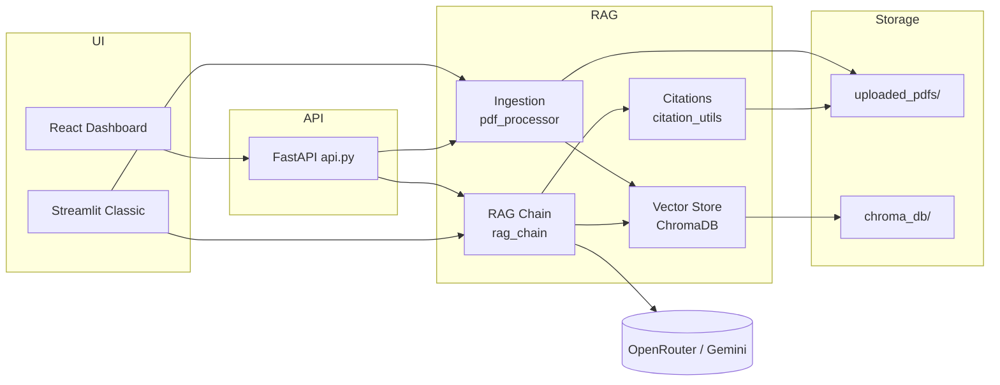
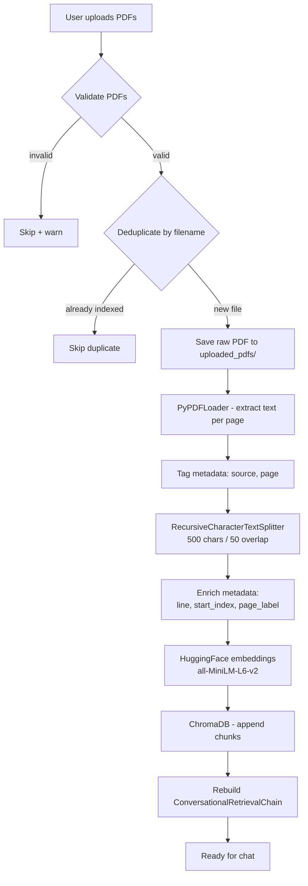
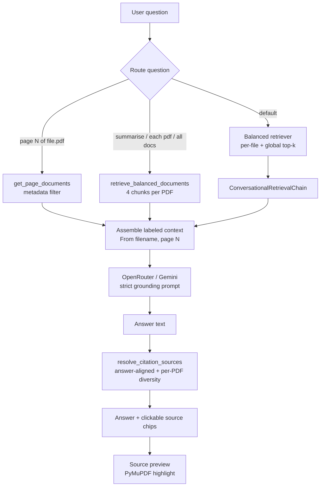

# Design Document — Multi-PDF ChatBot

Technical reference for how the system is built: architecture, pipelines, design decisions, API contract, and known limitations.

**Audience:** Developers, reviewers, and contributors.  
**Companion doc:** [USER_MANUAL.md](./USER_MANUAL.md) (end-user guide).

---

## 1. Overview

### Problem

Users often need to ask questions across several PDF documents at once. A single-document chatbot cannot answer cross-file questions like “What is each PDF about?” or “Compare the policies in these two reports.”

### Solution

Multi-PDF ChatBot is a **Retrieval-Augmented Generation (RAG)** application that:

1. Ingests multiple PDFs into a shared vector index
2. Retrieves relevant chunks per question (with multi-PDF-aware routing)
3. Generates answers grounded only in uploaded content
4. Shows clickable source citations with optional highlighted PDF preview

### Scope

| In scope (PoC) | Out of scope (for now) |
|----------------|------------------------|
| Text-based PDFs | OCR / scanned image-only PDFs |
| Single-user sessions | Multi-tenant auth and billing |
| React + FastAPI + Streamlit UIs | Production-grade horizontal scaling |
| Local embeddings + remote LLM | Fully offline LLM |

### Live deployment

| Component | URL |
|-----------|-----|
| React UI (Vercel) | https://multi-pdf-chat-bot.vercel.app/ |
| FastAPI backend (Render) | https://multi-pdf-chatbot-y6nu.onrender.com |
| Streamlit classic | https://multi-pdf-chatbot-rb.streamlit.app/ |

---

## 2. System context



**Dual UI strategy**

- **React + FastAPI** — Primary experience: landing page, dashboard, source preview side panel.
- **Streamlit** — Self-contained classic UI; shares the same Python RAG modules without going through FastAPI.

Both paths call the same core modules (`pdf_processor`, `vector_store`, `rag_chain`, `citation_utils`).

---

## 3. Component map

| Component | File(s) | Responsibility |
|-----------|---------|----------------|
| React UI | `frontend/` | Landing, dashboard, chat, source viewer panel |
| FastAPI | `api.py`, `api_upload.py`, `api_source_preview.py` | Sessions, upload, chat, preview/download |
| Streamlit UI | `app.py`, `source_viewer.py` | Sidebar upload, chat, citation preview |
| PDF ingestion | `pdf_processor.py`, `pdf_storage.py` | Load, chunk, dedupe, persist raw PDFs |
| Vector store | `vector_store.py` | Embeddings, Chroma persistence, balanced retrieval |
| RAG chain | `rag_chain.py` | ConversationalRetrievalChain, memory, LLM calls |
| Citations | `citation_utils.py`, `utils.py` | Source chips, answer alignment, intent routing |
| Configuration | `config.py` | Constants, env vars, CORS origins |

---

## 4. RAG ingestion pipeline

**Goal:** Turn uploaded PDFs into searchable, citeable chunks with rich metadata.



### Step-by-step

| Step | Module | Detail |
|------|--------|--------|
| Upload | `api_upload.py` / `app.py` | React: FastAPI `UploadFile`; Streamlit: `st.file_uploader` |
| Validation | `utils.py` | PDF extension + non-empty file check |
| Dedup | `filter_new_files()` | Filename match against indexed sources — no re-embedding |
| Persist PDF | `pdf_storage.py` | `uploaded_pdfs/{filename}` for source preview |
| Extract | `pdf_processor.py` | Temp file → PyPDFLoader → one `Document` per page |
| Chunk | `pdf_processor.py` | Split **per page** so `line` metadata stays accurate |
| Embed | `vector_store.py` | Local `all-MiniLM-L6-v2` (384-dim); torch loaded before chromadb on Windows |
| Store | `vector_store.py` | Streamlit: `./chroma_db/` · React API: `./chroma_db/api_sessions/{session_id}/` |
| Index mode | `create_or_update_vector_store()` | **Append** — new PDFs accumulate; existing chunks are kept |

### Chunk metadata

Every stored vector carries:

```json
{
  "source": "report.pdf",
  "page": 0,
  "page_label": 1,
  "line": 12,
  "start_index": 340
}
```

- `page` is zero-based (PyPDF convention); `page_label` is human-readable (1-based).
- `line` and `start_index` power citation highlighting in the source viewer.

---

## 5. RAG retrieval pipeline

**Goal:** Retrieve the right context per question type, generate a grounded answer, and show citations that match what the user read.



### Question routing

| Route | Trigger | Retrieval strategy |
|-------|---------|-------------------|
| **Page-targeted** | `"page 7 of report.pdf"` | `get_page_documents()` — all chunks on that page |
| **Multi-doc overview** | `"summarise"`, `"what each pdf is about"` | `retrieve_balanced_documents(per_file_k=4)` → `answer_from_documents()` |
| **Default Q&A** | Everything else | `ConversationalRetrievalChain` with balanced retriever |

### Balanced retrieval

`retrieve_balanced_documents()` is the core fix for multi-PDF skew:

1. For each indexed filename, run similarity search scoped to that file (`filter: {source: filename}`)
2. Merge with global top-k results (`TOP_K_RESULTS = 8` in `config.py`)
3. Deduplicate by `(source, page, start_index, content)`

Without this, one large PDF can fill all retrieval slots and starve smaller documents.

### Citation resolution

`resolve_citation_sources()` in `citation_utils.py`:

- Re-ranks retrieved chunks against the generated answer (embedding + lexical overlap)
- When the answer mentions multiple PDFs, ensures **at least one citation per file**
- Caps visible sources at `CITATION_MAX_SOURCES` (default 4)

### Grounding prompt

The system prompt (`SYSTEM_PROMPT_TEMPLATE` in `config.py`) instructs the LLM to answer only from provided context and to reply exactly:

> "I don't have enough information in the uploaded documents to answer this."

when context is irrelevant. This reduces hallucination outside uploaded content.

---

## 6. Design decisions

| Decision | Choice | Alternatives considered | Rationale |
|----------|--------|-------------------------|-----------|
| Embeddings | Local `all-MiniLM-L6-v2` | OpenAI embeddings | No API key, ~90 MB one-time download, fast on CPU |
| Vector DB | ChromaDB (embedded) | Pinecone | Zero infra for PoC; persists to disk |
| Chunk size | 500 / 50 overlap | Larger chunks | Balance retrieval precision vs context window |
| Per-page chunking | Split one page at a time | Whole-document split | Accurate `line` numbers for citations |
| Dual UI | React + Streamlit | React only | Streamlit deploys quickly on Community Cloud |
| API layer | FastAPI for React only | Single monolith | Streamlit stays self-contained; shared Python core |
| Per-session Chroma (React) | `chroma_db/api_sessions/{id}/` | Global store | Session isolation; restorable after API restart |
| Balanced retrieval | Per-file + global merge | Plain top-k | Plain top-k failed on multi-PDF workloads |
| Overview routing | Regex intent detection | Single retrieval path | Overview questions need guaranteed per-file context |
| Citation diversity | Per-PDF minimum in UI | Raw top retrieved | Answer could cite 2 PDFs while UI showed 1 |
| PDF on disk | `uploaded_pdfs/` | Vectors only | PyMuPDF highlight preview needs the raw file |
| LLM provider | OpenRouter default | Gemini only | Flexible model choice; free-tier models available |
| Source preview (Streamlit Cloud) | PNG not iframe PDF | Embedded PDF viewer | Chrome blocks PDF iframes on Streamlit Cloud |
| Lazy imports (API) | Deferred torch/LangChain load | Eager import at startup | Render free tier (512 MB) OOM on cold start |

---

## 7. Data model and session state

### React API session (`AppSession` in `api.py`)

| Field | Type | Purpose |
|-------|------|---------|
| `session_id` | UUID string | Client identifier; keys Chroma persist dir |
| `messages` | List of dicts | Chat history for UI replay |
| `memory` | LangChain memory | Conversational context for follow-ups |
| `chain` | ConversationalRetrievalChain | RAG pipeline handle |
| `vector_store` | Chroma instance | Embedded chunks for this session |
| `indexed_files` | List of filenames | Quick index summary |

Sessions are held in an in-memory `_sessions` dict. On restart, a client can pass an existing `session_id` to restore Chroma from disk if the persist directory still exists.

### Persistence layout

```
chroma_db/
├── multi_pdf_store/          # Streamlit global collection (default path)
└── api_sessions/
    └── {session_id}/         # Per-session Chroma for React API

uploaded_pdfs/
└── {filename}.pdf            # Raw files for source preview
```

### What persists vs ephemeral

| Data | Persists across | Lost when |
|------|-----------------|-----------|
| Chroma vectors (disk) | API restart (same session_id) | Reset session; Render ephemeral disk wipe |
| Raw PDFs on disk | Same as above | Reset session; host disk cleared |
| Chat messages | Browser tab / API process lifetime | Refresh; API restart; clear chat |
| Embedding model cache | Host filesystem | New deploy without cache |

---

## 8. API contract (React backend)

Base URL (production): `https://multi-pdf-chatbot-y6nu.onrender.com`

All session-scoped endpoints accept optional query param `session_id`.

| Method | Endpoint | Purpose |
|--------|----------|---------|
| `GET` | `/api/health` | Health probe |
| `POST` | `/api/session` | Create new session; returns `{ session_id }` |
| `GET` | `/api/status` | Index stats, config, messages, example questions |
| `POST` | `/api/upload` | Multipart PDF upload; embed and index |
| `POST` | `/api/chat` | Ask a question; returns answer + sources |
| `POST` | `/api/clear-chat` | Clear messages; keep indexed PDFs |
| `POST` | `/api/reset` | Wipe chat, vectors, and stored PDFs |
| `POST` | `/api/source/preview` | PNG preview with yellow highlights |
| `POST` | `/api/source/download` | Downloadable annotated single-page PDF |

### Request / response shapes

**Chat**

```json
// POST /api/chat
{ "message": "Summarise the uploaded documents." }

// Response
{
  "answer": "...",
  "sources": [
    { "file": "report.pdf", "page": "3", "label": "report.pdf · p.3", "color": "brand" }
  ],
  "sources_text": "...",
  "messages": [ /* full chat history */ ]
}
```

**Source preview**

```json
// POST /api/source/preview
{
  "file": "report.pdf",
  "page": 3,
  "line": 12,
  "excerpt": "relevant passage text",
  "highlight_phrases": ["key phrase"],
  "label": "report.pdf · p.3"
}
```

Returns a PNG image (base64 or binary response per `api_source_preview.py` implementation).

**Upload**

- `multipart/form-data` with one or more `files` fields
- Response includes `processed`, `skipped`, `invalid`, `failed`, `indexed_files`

---

## 9. Configuration and security

### Environment variables

| Variable | Required | Purpose |
|----------|----------|---------|
| `OPENROUTER_API_KEY` | Yes (if OpenRouter) | LLM generation |
| `LLM_PROVIDER` | No | `openrouter` or `gemini` |
| `OPENROUTER_MODEL` | No | Model slug (default: `mistralai/mistral-7b-instruct`) |
| `GOOGLE_API_KEY` | If Gemini | Alternative LLM provider |
| `VECTOR_STORE` | No | `chroma` (default) or `pinecone` |
| `STREAMLIT_APP_URL` | No | Link shown in React dashboard |
| `FRONTEND_ALLOWED_ORIGINS` | Production | Comma-separated CORS origins for Vercel/Pages |

Frontend (Vercel):

| Variable | Purpose |
|----------|---------|
| `VITE_API_BASE_URL` | Render API URL baked in at build time |

### Security posture (PoC)

- API keys read from `.env` only — never hardcoded (`config.py`)
- CORS restricted to localhost + `FRONTEND_ALLOWED_ORIGINS`
- No authentication — not suitable for sensitive documents on public demos
- Uploaded PDFs stored on server disk — treat hosted instances as ephemeral

See [DEPLOY.md](../DEPLOY.md) for production setup.

---

## 10. Thinking approach

1. **Start simple** — Single PDF, top-k retrieval, Streamlit UI. Prove upload → embed → chat → cite end-to-end.
2. **Separate concerns** — One module per pipeline stage; UIs call shared core, not duplicate logic.
3. **Fix the right layer** — Multi-PDF bugs were retrieval skew and citation filtering, not indexing alone.
4. **Metadata is a product feature** — `source`, `page`, `line`, and `highlight_phrases` build user trust.
5. **Route by intent** — Page, overview, and Q&A questions need different retrieval strategies.
6. **Deploy constraints shape UX** — Streamlit Cloud PNG preview; React side panel with blob URLs.

---

## 11. Learnings

- **Top-k similarity is not multi-document aware.** Always ensure per-file representation before calling the LLM.
- **The LLM can summarize correctly while citations lie.** Citation resolution must enforce per-PDF diversity.
- **Session state matters for React.** Per-session Chroma paths and session restoration prevent upload/chat divergence after API restarts.
- **Incremental indexing must append, not replace.** `create_or_update_vector_store` with `existing_store` preserves prior PDFs.
- **Chunk size trades retrieval vs context.** 500-char chunks work for Q&A; overview questions benefit from 4+ chunks per file.
- **Local embeddings + remote LLM is practical.** Embeddings are free and private; only generation needs an API key.
- **Filename dedup is simple but effective.** Re-uploading the same filename is skipped — rename files to re-index changed content.
- **Lazy imports are required on constrained hosts.** Eager loading of torch + LangChain caused Render OOM/timeouts.

---

## 12. Known limitations

- Single-user / session-scoped — not designed for concurrent multi-user production load
- Text-based PDFs only — no OCR for scanned documents
- Chat history lost on browser refresh (indexed vectors may persist on disk)
- LLM rate limits apply per provider (OpenRouter / Gemini free tiers)
- Render free tier: API sleeps after ~15 min idle; ephemeral disk may wipe uploads between deploys
- Re-uploading an unchanged filename is skipped (by design)

---

## 13. Future scope

- **OCR for scanned documents** — Extract text from image-only PDFs before chunking
- **Suggested follow-up questions** — Contextual prompts after each answer; starter questions when chat is empty
- **Persistent volume / paid hosting** — Survive Render restarts without re-upload
- **Authentication** — Per-user document isolation
- **Pinecone option** — Already stubbed in `config.py` for larger-scale vector storage

---

## 14. Related documents

| Document | Purpose |
|----------|---------|
| [USER_MANUAL.md](./USER_MANUAL.md) | End-user how-to guide |
| [../README.md](../README.md) | Project overview, quick start, screenshots |
| [../DEPLOY.md](../DEPLOY.md) | Vercel + Render deployment steps |
| [../CLAUDE.md](../CLAUDE.md) | Agent/coding conventions for this repo |
