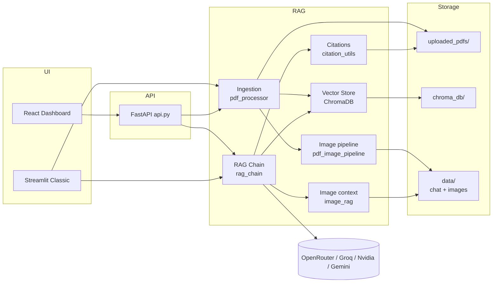
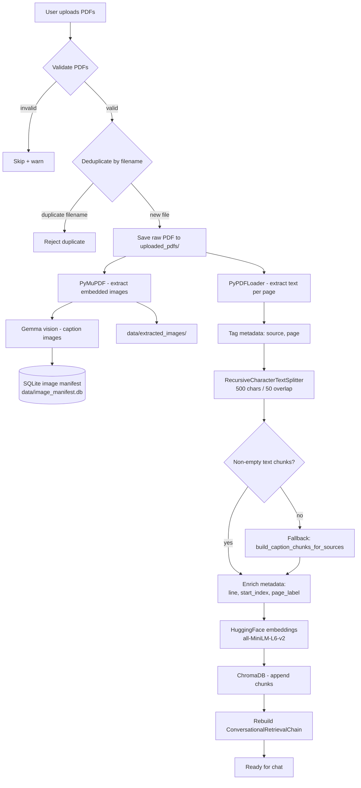
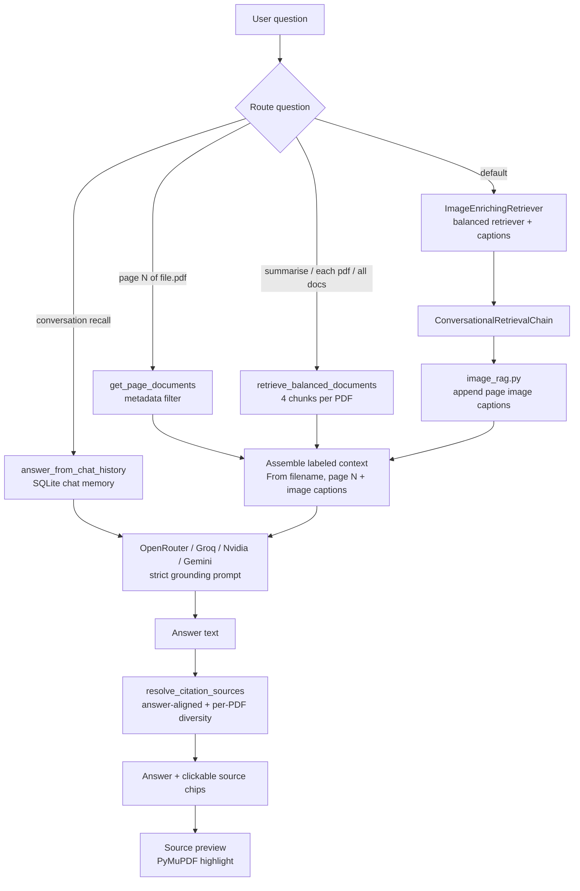

# Design Document — Multi-PDF ChatBot

Technical reference for how the system is built: architecture, pipelines, design decisions, API contract, and known limitations.

**Audience:** Developers, reviewers, and contributors.  
**Companion doc:** [USER_MANUAL.md](./USER_MANUAL.md) (end-user guide).

---

## 1. Overview

### Problem

Users often need to ask questions across several PDF documents at once. A single-document chatbot cannot answer cross-file questions like “What is each PDF about?” or “Compare the policies in these two reports.”

### Solution

Multi-PDF ChatBot is a **Retrieval-Augmented Generation (RAG)** application that:

1. Ingests multiple PDFs into a shared vector index
2. Retrieves relevant chunks per question (with multi-PDF-aware routing)
3. Generates answers grounded only in uploaded content
4. Shows clickable source citations with optional highlighted PDF preview

### Scope

| In scope (PoC) | Out of scope (for now) |
|----------------|------------------------|
| Text-based PDFs | Full OCR for scanned page bitmaps |
| Embedded image extraction + Gemma captions | Image vectors in Chroma |
| Image-heavy PDF fallback (caption chunks) | Production multi-tenant auth |
| React + FastAPI + Streamlit UIs | Production-grade horizontal scaling |
| SQLite persistent chat memory | Cross-device chat sync |
| Local embeddings + remote LLM | Fully offline LLM |

### Live deployment

| Component | URL |
|-----------|-----|
| React UI (Vercel) | https://multi-pdf-chat-bot.vercel.app/ |
| FastAPI backend (Render) | https://multi-pdf-chatbot-y6nu.onrender.com |
| Streamlit classic | https://multi-pdf-chatbot-rb.streamlit.app/ |

---

## 2. System context



**Dual UI strategy**

- **React + FastAPI** — Primary experience: landing page, dashboard, source preview side panel.
- **Streamlit** — Self-contained classic UI; shares the same Python RAG modules without going through FastAPI.

Both paths call the same core modules (`pdf_processor`, `pdf_image_pipeline`, `vector_store`, `rag_chain`, `image_rag`, `citation_utils`).

---

## 3. Component map

| Component | File(s) | Responsibility |
|-----------|---------|----------------|
| React UI | `frontend/` | Landing, dashboard, chat, source viewer panel |
| FastAPI | `api.py`, `api_upload.py`, `api_source_preview.py` | Sessions, upload, chat, preview/download, image listing |
| Streamlit UI | `app.py`, `source_viewer.py` | Sidebar upload, chat, citation preview |
| PDF ingestion | `pdf_processor.py`, `pdf_storage.py` | Load, chunk, dedupe, persist raw PDFs |
| Image extraction | `pdf_image_extractor.py`, `image_store.py` | PyMuPDF extract → disk + SQLite manifest |
| Image captioning | `image_captioner.py`, `pdf_image_pipeline.py` | Gemma vision captions; caption-chunk fallback |
| Image RAG context | `image_rag.py` | Append page image captions to retrieved chunks |
| Vector store | `vector_store.py` | Embeddings, Chroma persistence, balanced retrieval |
| RAG chain | `rag_chain.py` | ConversationalRetrievalChain, SQLite chat history, LLM calls |
| Chat memory | `sqlite_memory.py` | SQLite schema, CRUD, `SqliteChatMessageHistory` |
| Citations | `citation_utils.py`, `utils.py` | Source chips, answer alignment, intent routing |
| Logging | All `.py` modules | Structured `logging` output: API calls, LLM invocations, indexing, errors |
| Configuration | `config.py` | Constants, env vars, CORS origins, `get_available_llm_options()` |

---

## 4. RAG ingestion pipeline

**Goal:** Turn uploaded PDFs into searchable, citeable chunks with rich metadata.



### Step-by-step

| Step | Module | Detail |
|------|--------|--------|
| Upload | `api_upload.py` / `app.py` | React: FastAPI `UploadFile`; Streamlit: `st.file_uploader` |
| Validation | `utils.py` | PDF extension + non-empty file check |
| Dedup | `filter_new_files()` | Rejects already-indexed files and duplicate filenames in the same upload batch |
| Persist PDF | `pdf_storage.py` | `uploaded_pdfs/{filename}` for source preview |
| Extract images | `pdf_image_extractor.py` | PyMuPDF → `data/extracted_images/{session_id}/{source_stem}/` |
| Caption images | `image_captioner.py` | Gemma vision (OpenRouter/Gemini) → SQLite manifest |
| Image manifest | `image_store.py` | `pdf_images` table in `data/image_manifest.db` (**not** in Chroma) |
| Orchestration | `pdf_image_pipeline.py` | `process_pdf_images()` on upload; caption-chunk fallback |
| Extract text | `pdf_processor.py` | Temp file → PyPDFLoader → one `Document` per page |
| Chunk | `pdf_processor.py` | Split **per page** so `line` metadata stays accurate |
| Caption fallback | `build_caption_chunks_for_sources()` | When text chunks are empty, index Gemma captions as text |
| Embed | `vector_store.py` | Local `all-MiniLM-L6-v2` (384-dim); torch loaded before chromadb on Windows |
| Store | `vector_store.py` | Streamlit: `./chroma_db/` · React API: `./chroma_db/api_sessions/{session_id}/` |
| Index mode | `create_or_update_vector_store()` | **Append** with `existing_store`; recreates collection if add yields 0 chunks |

### Chunk metadata

Every stored vector carries:

```json
{
  "source": "report.pdf",
  "page": 0,
  "page_label": 1,
  "line": 12,
  "start_index": 340
}
```

- `page` is zero-based (PyPDF convention); `page_label` is human-readable (1-based).
- `line` and `start_index` power citation highlighting in the source viewer.
- Caption-fallback chunks may include `from_image_captions: true` in metadata.

See also: [MULTIMODAL_DESIGN.md](./MULTIMODAL_DESIGN.md) for the full image pipeline rationale.

---

## 5. RAG retrieval pipeline

**Goal:** Retrieve the right context per question type, generate a grounded answer, and show citations that match what the user read.



### Question routing

| Route | Trigger | Retrieval strategy |
|-------|---------|-------------------|
| **Conversation recall** | `"what was my previous question?"` | `answer_from_chat_history()` — reads SQLite, not PDFs |
| **Page-targeted** | `"page 7 of report.pdf"` | `get_page_documents()` + `enrich_documents_with_image_context()` |
| **Multi-doc overview** | `"summarise"`, `"what each pdf is about"` | `retrieve_balanced_documents(per_file_k=4)` → `answer_from_documents()` |
| **Default Q&A** | Everything else | `ConversationalRetrievalChain` with `ImageEnrichingRetriever` |

### Balanced retrieval

`retrieve_balanced_documents()` is the core fix for multi-PDF skew:

1. For each indexed filename, run similarity search scoped to that file (`filter: {source: filename}`)
2. Merge with global top-k results (`TOP_K_RESULTS = 8` in `config.py`)
3. Deduplicate by `(source, page, start_index, content)`

Without this, one large PDF can fill all retrieval slots and starve smaller documents.

### Citation resolution

`resolve_citation_sources()` in `citation_utils.py`:

- Re-ranks retrieved chunks against the generated answer (embedding + lexical overlap + question overlap)
- Uses stricter support thresholds to reduce false-positive citations
- When the answer mentions multiple PDFs, ensures **at least one citation per file**
- Selects tighter excerpt fragments and adjusts line numbers for more precise highlighting
- Caps visible sources at `CITATION_MAX_SOURCES` (default 4)

Source preview (`api_source_preview.py`, `source_viewer.py`):

- Searches answer-aligned phrases first, then narrows matches to the cited line when `line` metadata is present
- Goal: a citation like `page 1, line 4` highlights that line, not broad page-wide text

### Grounding prompt

The system prompt (`SYSTEM_PROMPT_TEMPLATE` in `config.py`) instructs the LLM to answer only from provided context and to reply exactly:

> "I don't have enough information in the uploaded documents to answer this."

when context is irrelevant. This reduces hallucination outside uploaded content.

### Session chat history

- `get_memory(session_id)` returns `SqliteChatMessageHistory` backed by `./data/chat_memory.db`
- `build_rag_chain()` rebuilds the chain when the vector store or selected model changes; `get_retriever(vector_store, session_id)` wraps balanced retrieval with image caption enrichment
- `query_chain()` passes `chat_history` into the chain and appends Human/AI messages after each response
- Overview/page-targeted paths use `add_user_message()` / `add_ai_message()` for the same history object
- Meta questions (`is_conversation_recall_question`) route to `answer_from_chat_history()` before RAG

### Suggested questions

After indexing, `generate_suggested_questions()` retrieves broad context and asks the LLM for PDF-specific starter prompts (replaces static examples when successful).

### LLM provider selection

`config.py` exposes `get_available_llm_options()` and `get_default_llm_option()` based on which API keys are set. The React dashboard and Streamlit sidebar call these to populate the **Models** dropdown; `POST /api/model` persists the choice per API session.

### LLM sampling defaults

- `top_p = 0.85` keeps output natural while cutting low-probability random words.
- `top_k = 40` is a widely used default that balances variety and focus.
- This `top_k` is **decoding top-k**, not retrieval `TOP_K_RESULTS` in `config.py`.

---

## 6. Design decisions

| Decision | Choice | Alternatives considered | Rationale |
|----------|--------|-------------------------|-----------|
| Embeddings | Local `all-MiniLM-L6-v2` | OpenAI embeddings | No API key, ~90 MB one-time download, fast on CPU |
| Vector DB | ChromaDB (embedded) | Pinecone | Zero infra for PoC; persists to disk |
| Chunk size | 500 / 50 overlap | Larger chunks | Balance retrieval precision vs context window |
| Per-page chunking | Split one page at a time | Whole-document split | Accurate `line` numbers for citations |
| Dual UI | React + Streamlit | React only | Streamlit deploys quickly on Community Cloud |
| API layer | FastAPI for React only | Single monolith | Streamlit stays self-contained; shared Python core |
| Per-session Chroma (React) | `chroma_db/api_sessions/{id}/` | Global store | Session isolation; restorable after API restart |
| Per-session chat history | `SqliteChatMessageHistory` + SQLite | `InMemoryChatMessageHistory` | Survives process restart; isolated per session |
| Runtime model selection | `Models` dropdown in UI | Fixed `.env` provider only | Users can switch among configured providers without redeploying |
| Balanced retrieval | Per-file + global merge | Plain top-k | Plain top-k failed on multi-PDF workloads |
| Overview routing | Regex intent detection | Single retrieval path | Overview questions need guaranteed per-file context |
| Citation diversity | Per-PDF minimum in UI | Raw top retrieved | Answer could cite 2 PDFs while UI showed 1 |
| Precise highlight targeting | Line-aware phrase search | Whole-page text search | Cited `page` + `line` should highlight that line only |
| Duplicate upload handling | Hard reject with existing doc reference | Silent skip | Prevents duplicate indexing in the same batch or re-upload |
| PDF on disk | `uploaded_pdfs/` | Vectors only | PyMuPDF highlight preview needs the raw file |
| Images outside Chroma | `data/extracted_images/` + SQLite manifest | Store image bytes in Chroma | Caption with Gemma; index caption **text** only |
| Image caption model | Separate `IMAGE_CAPTION_MODEL` | Reuse chat LLM slug | Chat models may be text-only; vision needs Gemma 3+ |
| Index validation | Verify `indexed_files` + `chain` after upload | Trust success message alone | Image-only PDFs previously showed success with 0 chunks |
| LLM providers | OpenRouter, Groq, Nvidia, Gemini | Single provider only | Runtime choice via UI; keys from `.env` |
| LLM sampling | `top_p=0.85`, `top_k=40` | Provider defaults | Reduces odd word choices while preserving natural variation |
| Source preview (Streamlit Cloud) | PNG not iframe PDF | Embedded PDF viewer | Chrome blocks PDF iframes on Streamlit Cloud |
| Structured logging | Python `logging` in every module | `print` statements | Consistent timestamped format with levels and module names; configurable via `LOG_LEVEL` env var |
| Lazy imports (API) | Deferred torch/LangChain load | Eager import at startup | Render free tier (512 MB) OOM on cold start |

---

## 7. Data model and session state

### React API session (`AppSession` in `api.py`)

| Field | Type | Purpose |
|-------|------|---------|
| `session_id` | UUID string | Client identifier; keys Chroma persist dir |
| `messages` | List of dicts | Chat history for UI replay |
| `memory` | `SqliteChatMessageHistory` | Persistent conversational context in SQLite |
| `chain` | ConversationalRetrievalChain | RAG pipeline handle |
| `vector_store` | Chroma instance | Embedded chunks for this session |
| `indexed_files` | List of filenames | Quick index summary |
| `llm_provider` | string | Active provider for this session (`openrouter`, `groq`, `nvidia`, `gemini`) |
| `llm_model` | string | Active model slug/name for this session |

Sessions are held in an in-memory `_sessions` dict. The React UI stores `session_id` in browser `localStorage`. On API restart, a client can pass an existing `session_id` to restore Chroma from disk if the persist directory still exists.

### Streamlit session (`st.session_state`)

| Key | Purpose |
|-----|---------|
| `memory` | `SqliteChatMessageHistory` for follow-up context |
| `selected_llm_provider` / `selected_llm_model` | Active model from the sidebar **Models** dropdown |
| `chain`, `vector_store`, `indexed_files` | RAG pipeline state (same concepts as API session) |

### Persistence layout

```
chroma_db/
├── multi_pdf_store/          # Streamlit global collection (default path)
└── api_sessions/
    └── {session_id}/         # Per-session Chroma for React API

uploaded_pdfs/
└── {filename}.pdf            # Raw files for source preview

data/                         # git-ignored; auto-created
├── chat_memory.db            # SQLite chat sessions + messages
├── image_manifest.db         # Extracted image metadata + captions
├── extracted_images/         # PNG/JPEG from PDFs
│   └── {session_id}/{source_stem}/
└── streamlit_session_id      # Stable Streamlit session id file
```

### SQLite chat memory

Persistent conversation history lives in `sqlite_memory.py` (default `./data/chat_memory.db`). LangChain reads/writes via `SqliteChatMessageHistory`.

**Schema**

| Table | Column | Type | Purpose |
|-------|--------|------|---------|
| `chat_sessions` | `session_id` | TEXT PK | UUID matching API / Streamlit session |
| | `summary` | TEXT NULL | Rolling conversation summary (optional compression) |
| | `created_at` | TEXT | ISO8601 UTC |
| | `updated_at` | TEXT | ISO8601 UTC |
| `chat_messages` | `id` | INTEGER PK | Stable insert order |
| | `session_id` | TEXT FK | Links to `chat_sessions` |
| | `timestamp` | TEXT | ISO8601 UTC |
| | `role` | TEXT | `user`, `assistant`, or `system` |
| | `content` | TEXT | Message body |

**CRUD operations**

- Create session, append message, retrieve messages, update summary, clear messages, delete session
- PyTest coverage in `tests/test_sqlite_memory.py` and `tests/test_conversation_recall.py`

Streamlit stores a stable `session_id` in `data/streamlit_session_id`. React stores `session_id` in browser `localStorage` (`mpdf_session_id`).

### SQLite image manifest

Extracted images are tracked in `image_store.py` (default `./data/image_manifest.db`).

| Table | Column | Purpose |
|-------|--------|---------|
| `pdf_images` | `image_id` | Primary key |
| | `session_id`, `source`, `page`, `page_label`, `image_index` | Locate image in a PDF |
| | `file_path` | On-disk PNG/JPEG under `data/extracted_images/` |
| | `caption`, `caption_model` | Gemma-generated description (text only in RAG) |
| | `bytes_sha256` | Dedup identical embedded images |

### What persists vs ephemeral

| Data | Persists across | Lost when |
|------|-----------------|-----------|
| Chroma vectors (disk) | API restart (same session_id) | Reset session; Render ephemeral disk wipe |
| Raw PDFs on disk | Same as above | Reset session; host disk cleared |
| Extracted images + manifest | Same session_id on disk | Reset session; `delete_images_for_session()` |
| Chat messages (LangChain) | SQLite (`CHAT_DB_PATH`) | Clear chat; reset session |
| Chat UI replay (`messages`) | Reloaded from SQLite on status/refresh | Clear chat; reset session |
| Source chips in UI history | Not persisted in SQLite | Page refresh (text messages reload) |
| Embedding model cache | Host filesystem | New deploy without cache |

---

## 8. API contract (React backend)

Base URL (production): `https://multi-pdf-chatbot-y6nu.onrender.com`

All session-scoped endpoints accept optional query param `session_id`.

| Method | Endpoint | Purpose |
|--------|----------|---------|
| `GET` | `/api/health` | Health probe |
| `POST` | `/api/session` | Create new session; returns `{ session_id }` |
| `GET` | `/api/status` | Index stats, config, messages, available models, selected model |
| `POST` | `/api/model` | Set active provider/model for this session |
| `POST` | `/api/upload` | Multipart PDF upload; embed and index |
| `POST` | `/api/chat` | Ask a question; returns answer + sources |
| `POST` | `/api/clear-chat` | Clear messages; keep indexed PDFs |
| `POST` | `/api/reset` | Wipe chat, vectors, and stored PDFs |
| `POST` | `/api/source/preview` | PNG preview with yellow highlights |
| `POST` | `/api/source/download` | Downloadable annotated single-page PDF |
| `GET` | `/api/images` | List extracted images + captions (`?source=&page=`) |
| `GET` | `/api/images/{image_id}/file` | Serve extracted image bytes |

### Request / response shapes

**Chat**

```json
// POST /api/chat
{ "message": "Summarise the uploaded documents." }

// Response
{
  "answer": "...",
  "sources": [
    { "file": "report.pdf", "page": "3", "label": "report.pdf · p.3", "color": "brand" }
  ],
  "sources_text": "...",
  "messages": [ /* full chat history */ ]
}
```

**Source preview**

```json
// POST /api/source/preview
{
  "file": "report.pdf",
  "page": 3,
  "line": 12,
  "excerpt": "relevant passage text",
  "highlight_phrases": ["key phrase"],
  "label": "report.pdf · p.3"
}
```

Returns a PNG image (base64 or binary response per `api_source_preview.py` implementation).

**Upload**

- `multipart/form-data` with one or more `files` fields
- Pipeline order: save PDF → extract/caption images → load text → embed (or caption fallback)
- Success response includes `processed`, `invalid`, `failed`, `indexed_files`, `image_summary`
- `indexed_files` entries include `images` count per file
- Duplicate filenames return **HTTP 409** with:

```json
{
  "detail": {
    "message": "you cannot add same file twice",
    "existing_references": [
      { "name": "report.pdf", "pages": 12, "chunks": 48 }
    ]
  }
}
```

**Model selection**

```json
// POST /api/model
{ "provider": "groq", "model": "meta-llama/llama-4-scout-17b-16e-instruct" }

// Response
{
  "message": "Model updated.",
  "selected_model": {
    "provider": "groq",
    "model": "meta-llama/llama-4-scout-17b-16e-instruct"
  }
}
```

`GET /api/status` also returns:

```json
{
  "available_models": [
    { "provider": "openrouter", "model": "...", "label": "OpenRouter - ..." }
  ],
  "selected_model": { "provider": "openrouter", "model": "..." }
}
```

---

## 9. Configuration and security

### Environment variables

| Variable | Required | Purpose |
|----------|----------|---------|
| `LLM_PROVIDER` | No | `openrouter`, `groq`, `nvidia`, or `gemini` |
| `OPENROUTER_API_KEY` | If OpenRouter | LLM generation |
| `OPENROUTER_MODEL` | No | OpenRouter model slug |
| `GROQ_API_KEY` | If Groq | LLM generation |
| `GROQ_MODEL` | No | Groq model slug (default: `meta-llama/llama-4-scout-17b-16e-instruct`) |
| `NVIDIA_API_KEY` | If Nvidia | LLM generation |
| `NVIDIA_MODEL` | No | Nvidia NIM model (default: `meta/llama-4-maverick-17b-128e-instruct`) |
| `GOOGLE_API_KEY` | If Gemini | Alternative LLM provider |
| `GEMINI_MODEL_NAME` | No | Gemini model name |
| `LLM_TOP_P` | No | Decoding `top_p` (default `0.85`) |
| `LLM_TOP_K` | No | Decoding `top_k` (default `40`) |
| `LLM_FREQUENCY_PENALTY` | No | OpenRouter frequency penalty |
| `VECTOR_STORE` | No | `chroma` (default) or `pinecone` |
| `CHAT_DB_PATH` | No | SQLite file for persistent chat memory (default `./data/chat_memory.db`) |
| `IMAGE_EXTRACTION_ENABLED` | No | Enable PyMuPDF image extraction (default `true`) |
| `IMAGE_CAPTION_ENABLED` | No | Caption images with Gemma vision at ingest (default `true`) |
| `IMAGE_CAPTION_PROVIDER` | No | `openrouter` or `gemini` for vision model |
| `IMAGE_CAPTION_MODEL` | No | Vision-capable Gemma slug (e.g. `google/gemma-3-12b-it`) |
| `IMAGE_DB_PATH` | No | SQLite image manifest (default `./data/image_manifest.db`) |
| `EXTRACTED_IMAGES_DIR` | No | On-disk image folder (default `./data/extracted_images`) |
| `STREAMLIT_APP_URL` | No | Link shown in React dashboard |
| `LOG_LEVEL` | No | Python log level: `DEBUG`, `INFO` (default), `WARNING`, `ERROR` |
| `FRONTEND_ALLOWED_ORIGINS` | Production | Comma-separated CORS origins for Vercel/Pages |

Frontend (Vercel):

| Variable | Purpose |
|----------|---------|
| `VITE_API_BASE_URL` | Render API URL baked in at build time |

### Security posture (PoC)

- API keys read from `.env` only — never hardcoded (`config.py`)
- CORS restricted to localhost + `FRONTEND_ALLOWED_ORIGINS`
- No authentication — not suitable for sensitive documents on public demos
- Uploaded PDFs stored on server disk — treat hosted instances as ephemeral

See [DEPLOY.md](../DEPLOY.md) for production setup.

---

## 10. Thinking approach

1. **Start simple** — Single PDF, top-k retrieval, Streamlit UI. Prove upload → embed → chat → cite end-to-end.
2. **Separate concerns** — One module per pipeline stage; UIs call shared core, not duplicate logic.
3. **Fix the right layer** — Multi-PDF bugs were retrieval skew and citation filtering, not indexing alone.
4. **Metadata is a product feature** — `source`, `page`, `line`, and `highlight_phrases` build user trust.
5. **Route by intent** — Page, overview, and Q&A questions need different retrieval strategies.
6. **Deploy constraints shape UX** — Streamlit Cloud PNG preview; React side panel with blob URLs.

---

## 11. Learnings

- **Top-k similarity is not multi-document aware.** Always ensure per-file representation before calling the LLM.
- **The LLM can summarize correctly while citations lie.** Citation resolution must enforce per-PDF diversity.
- **Session state matters for React.** Per-session Chroma paths and session restoration prevent upload/chat divergence after API restarts.
- **Incremental indexing must append, not replace.** `create_or_update_vector_store` with `existing_store` preserves prior PDFs.
- **Chunk size trades retrieval vs context.** 500-char chunks work for Q&A; overview questions benefit from 4+ chunks per file.
- **Local embeddings + remote LLM is practical.** Embeddings are free and private; only generation needs an API key.
- **Duplicate uploads need explicit rejection.** The app blocks already-indexed files and duplicate filenames in the same upload batch, returning the existing document reference.
- **Line-aware highlighting improves trust.** Narrowing highlights to the cited line/fragment avoids broad page-wide marks that look imprecise.
- **Session-scoped chat history matters.** `SqliteChatMessageHistory` keeps each session isolated while surviving API/Streamlit restarts.
- **Lazy imports are required on constrained hosts.** Eager loading of torch + LangChain caused Render OOM/timeouts.
- **Image-only PDFs need a fallback path.** Text chunking alone yields zero vectors; caption chunks unblock chat.
- **Do not store images in Chroma.** Gemma captions as text + disk references match the multimodal design constraint.
- **Validate indexing before declaring success.** Empty Chroma collections previously left chat disabled with a misleading success toast.
- **Structured logging is essential for debugging RAG.** Every module logs API calls, LLM invocations, indexing steps, and errors to the terminal with timestamps and module names, making it possible to trace an entire request through the pipeline.

---

## 12. Known limitations

- Single-user / session-scoped — not designed for concurrent multi-user production load
- Text-first PDFs work best; image-heavy PDFs rely on Gemma captions (not full-page OCR)
- Embedded images only — scanned pages without embedded image objects need a future render path
- Chat history persists in SQLite per `session_id`, but source chips in UI history are not stored
- LLM rate limits apply per provider (OpenRouter / Groq / Nvidia / Gemini free tiers); captioning uses a separate vision model
- Render free tier: API sleeps after ~15 min idle; ephemeral disk may wipe uploads between deploys
- Duplicate filenames are rejected with `you cannot add same file twice` (not silently skipped)

---

## 13. Future scope

- **OCR for scanned documents** — full-page OCR when neither text nor embedded images exist
- **Image thumbnails in citations** — show extracted figures beside source chips
- **Query-time captioning** — caption uncaptioned images on demand
- **Persistent volume / paid hosting** — Survive Render restarts without re-upload
- **Authentication** — Per-user document isolation
- **Pinecone option** — Already stubbed in `config.py` for larger-scale vector storage

---

## 14. Related documents

| Document | Purpose |
|----------|---------|
| [USER_MANUAL.md](./USER_MANUAL.md) | End-user how-to guide |
| [MULTIMODAL_DESIGN.md](./MULTIMODAL_DESIGN.md) | Image extraction, Gemma captions, multimodal RAG |
| [../README.md](../README.md) | Project overview, quick start, screenshots |
| [../DEPLOY.md](../DEPLOY.md) | Vercel + Render deployment steps |
| [../CLAUDE.md](../CLAUDE.md) | Agent/coding conventions for this repo |
